# Mobile Chat Application (React Native)

A mobile messaging application built with React Native, featuring real-time chat UI, authentication with OTP, and optimized user experience for conversations.

---

## 🧩 Problem

Messaging applications require smooth conversation flows, intuitive UI, and responsive interactions to provide a seamless user experience on mobile devices.

---

## 💡 Solution

Built a React Native chat application focusing on conversation experience, including authentication, message display, and interaction patterns similar to modern messaging apps.

---

## ⚙️ Tech Stack

- React Native (Expo)
- Clerk (OTP authentication)
- Gifted Chat (chat UI)
- Reanimated (animations)
- Gesture Handler (interactions)
- Expo Router (navigation)

---

## 🚀 Key Features

- Chat interface with message threads
- OTP-based authentication flow
- Contact and conversation management
- Smooth animations and gesture interactions
- Responsive UI optimized for mobile

---

## 🧠 Architecture

- Modular component-based UI for chat screens
- Navigation handled via Expo Router
- Authentication managed via Clerk (OTP flow)
- State-driven UI updates for message rendering

---

## ⚠️ Challenges & Solutions

**Building smooth chat interactions**
- Used optimized components and animations for fluid UX

**Authentication flow**
- Integrated OTP-based login for quick access

**UI responsiveness**
- Ensured consistent performance across devices

---

## 📸 Screenshots

<div style="display: flex; flex-direction: row;">
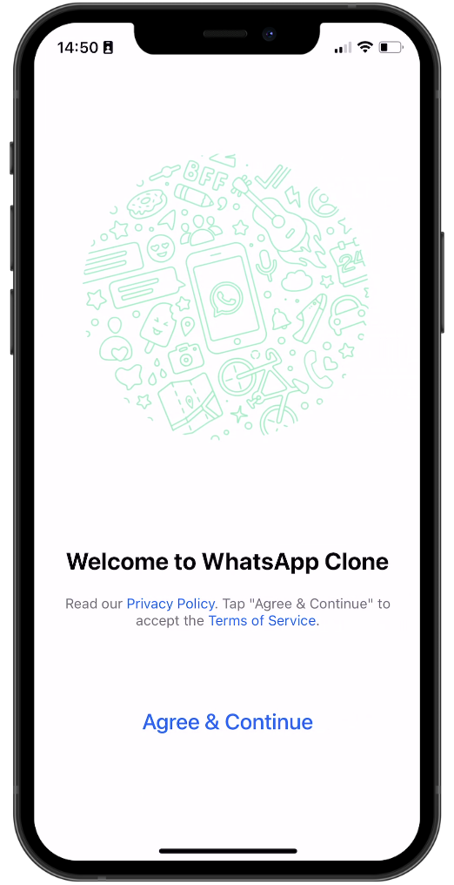
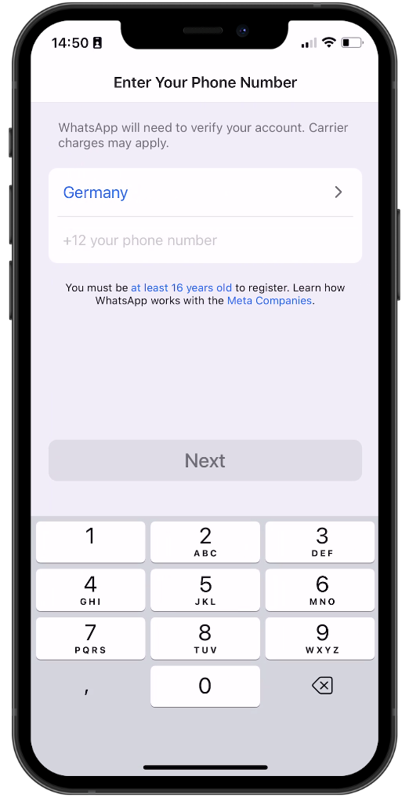
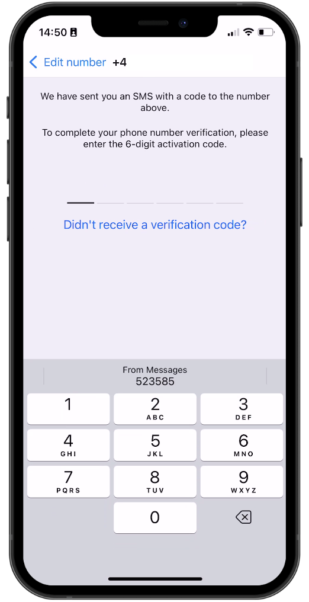
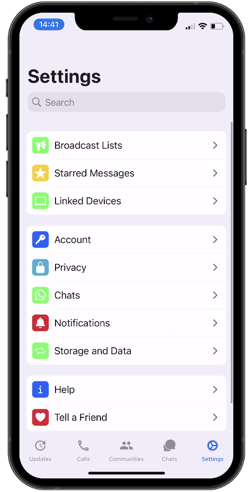
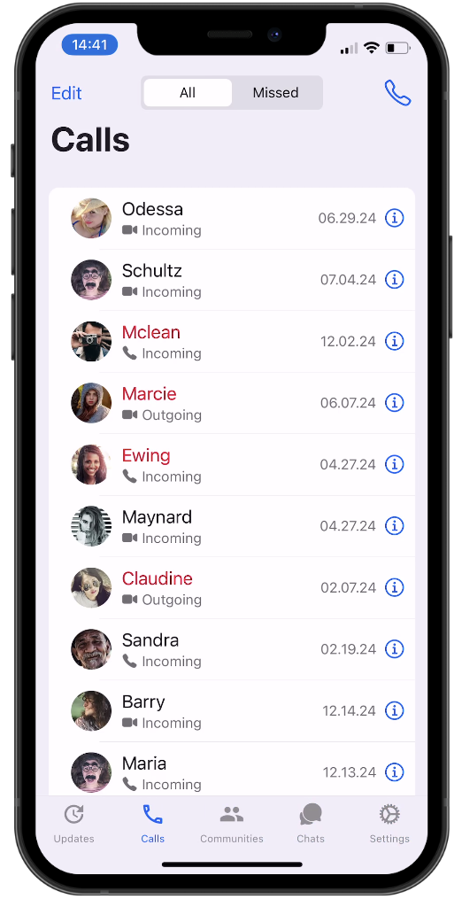
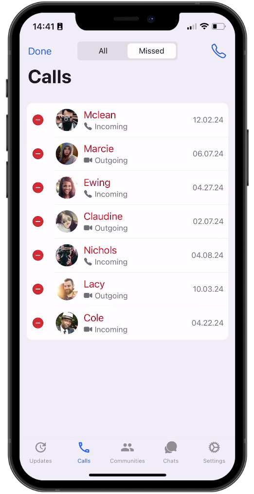
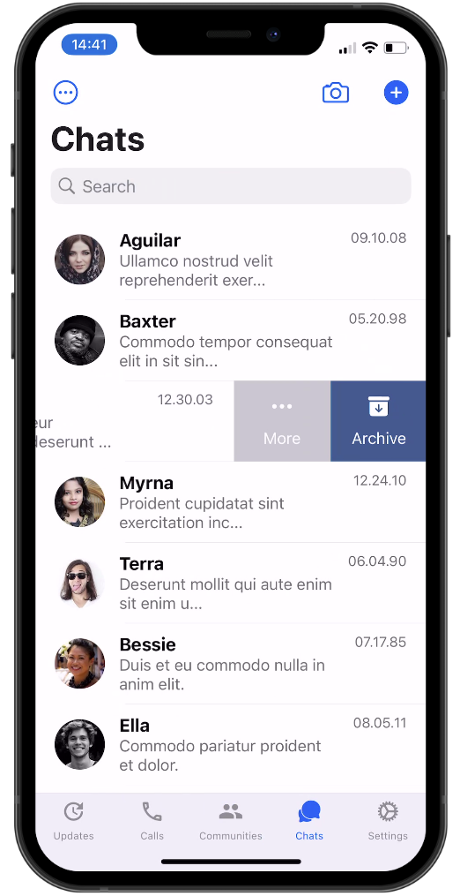
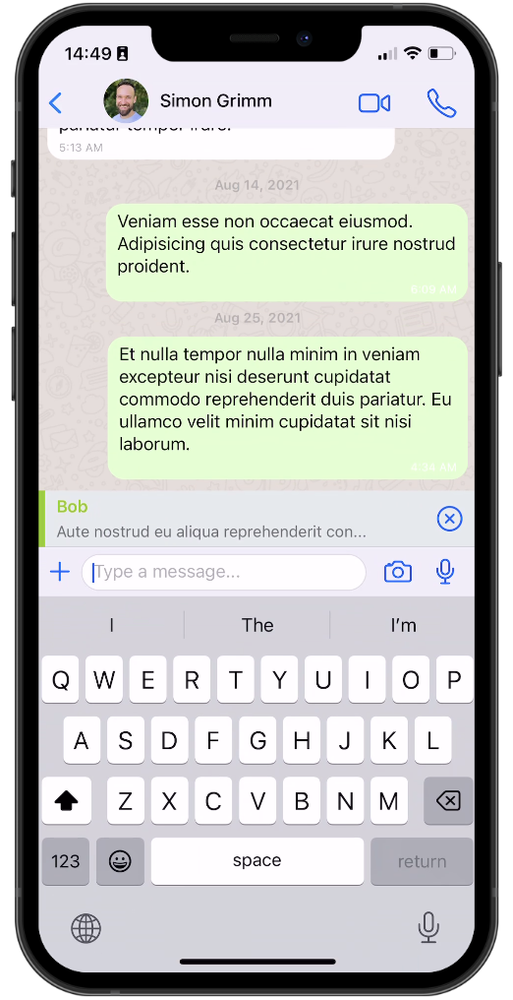
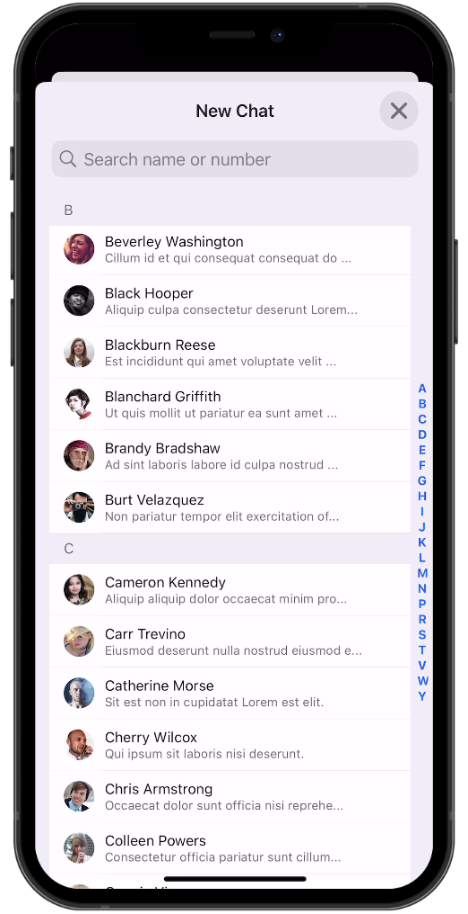
</div>

---

## 🎬 Demo

<div style="display: flex; flex-direction: row;">
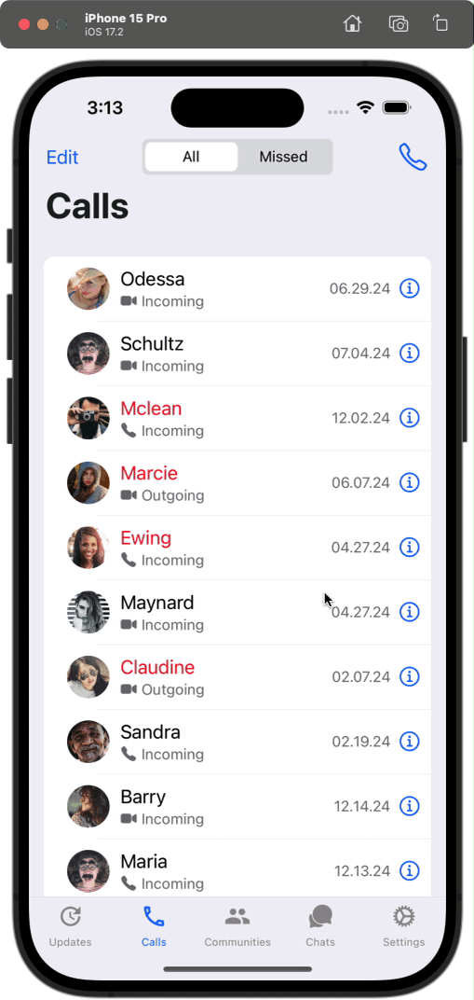
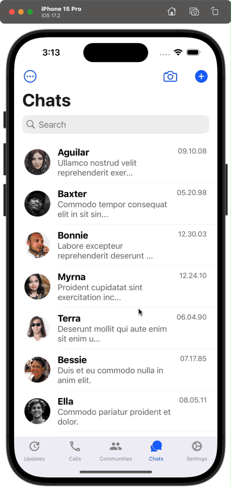


</div>

---

## ▶️ Running Locally

```bash
npm install
npx expo start
```

### Environment variables

```bash
CLERK_API_KEY=your_key
```

## Notes 
> This project focuses on mobile messaging UX and interaction design rather than backend real-time architecture.
